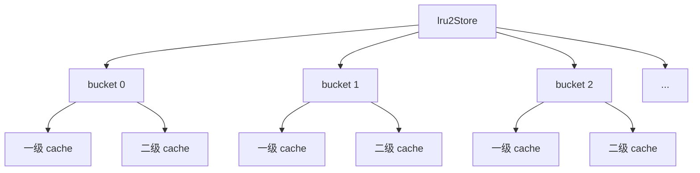
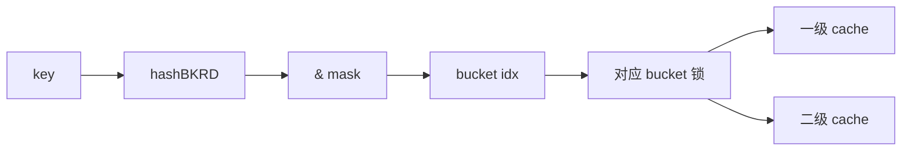
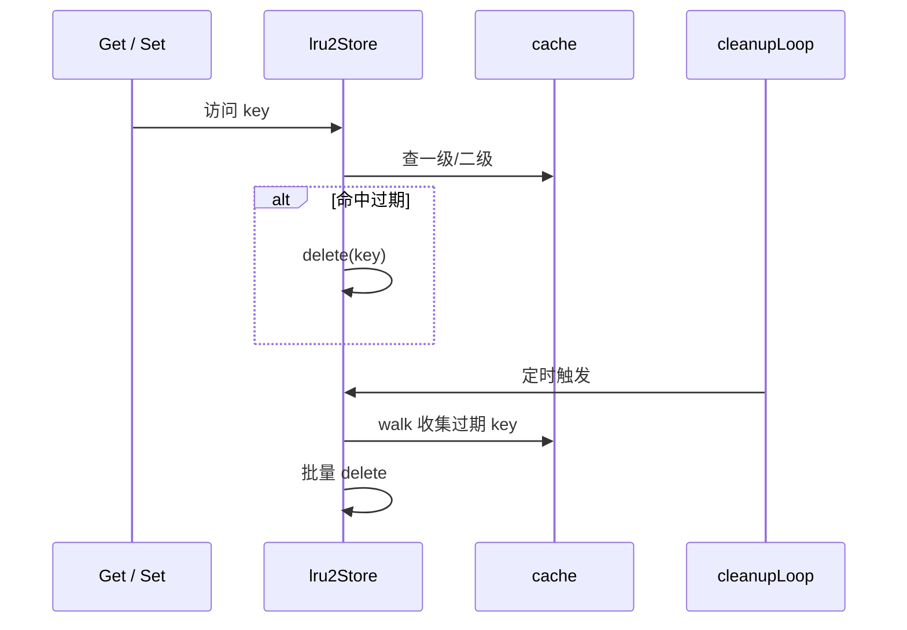
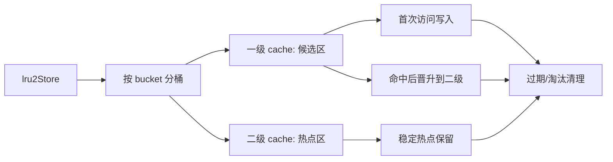

# LRU-2 结构与流程说明

> 目标：把当前项目里的 `store/lru2.go` 讲清楚，重点说明 `lru2Store`、`cache`、分桶、一级/二级缓存、过期清理、淘汰和命中提升的真实实现。
>
> 说明：本文只基于当前代码实现，不引入论文版 LRU-2 的额外假设。

---

## 1. 一句话理解

当前实现里的 LRU-2 可以理解成：

> **按 bucket 分桶的两级缓存系统：新写入先进入一级缓存，首次读取后晋升到二级缓存；一级和二级都是单层 LRU 容器。**

它的目的不是让单次查找更快，而是更好地区分：

- 偶发访问
- 稳定热点

---

## 2. 总体结构

```text
lru2Store
├─ locks[bucket]              // 每个桶一把锁
├─ caches[bucket][0]          // 一级 cache：候选区
├─ caches[bucket][1]          // 二级 cache：热点区
├─ onEvicted                  // 淘汰回调
├─ cleanupTick                // 定时清理过期项
└─ mask                       // bucket 计算掩码
```

### Mermaid 结构图



---

## 3. `lru2Store` 和 `cache` 的关系

### `lru2Store`
是外层管理器，负责：

- key 分桶
- bucket 加锁
- 组织一级 / 二级缓存
- 过期扫描
- 对外暴露 `Get / Set / Delete / Clear / Len / Close`

### `cache`
是内层单层 LRU 容器，负责：

- 真正存储 key/value
- 维护链表顺序
- 做单层缓存的 `put / get / del / walk / adjust`

### 一句话

> `lru2Store` 是调度器，`cache` 是干活的桶内容器。

---

## 4. 分桶是怎么做的

当前实现：

```go
idx := hashBKRD(key) & s.mask
```

流程是：

1. 对 key 做 BKDR 哈希
2. 用 `mask` 映射到 bucket
3. 同一个 bucket 内的 key 共享同一把锁和同一对一级/二级缓存

### Mermaid 流程图



### 分桶的作用

- 降低锁竞争
- 提高并发度
- 把热点冲突限制在局部 bucket 内

---

## 5. `cache` 的内部结构

单个 `cache` 里有：

```go
type cache struct {
    dlnk [][2]uint16       // 双向链表指针
    m    []node            // 节点数组
    hmap map[string]uint16 // key -> 节点索引
    last uint16            // 已使用槽位数
}
```

### 它做的事

- `hmap` 负责 O(1) 找 key
- `dlnk` 负责维护 LRU 顺序
- `m` 负责真正存 node
- `last` 负责判断数组是否已满

### 单层 cache 视图

```mermaid
flowchart TD
    K[key] --> H[hmap]
    H --> I[节点索引]
    I --> M[m[index-1]]
    M --> D[dlnk 维护顺序]
```

---

## 6. `Set` 的真实流程

`lru2Store.Set(key, value)` 的行为很简单：

1. 算 bucket
2. 锁住 bucket
3. **统一写入该 bucket 的一级 cache**
4. 一级 cache 自己决定是新增还是覆盖旧元素

### Mermaid 流程图

```mermaid
flowchart TD
    A[Set(key, value)] --> B[计算 bucket]
    B --> C[加 bucket 锁]
    C --> D[写入一级 cache]
    D --> E{一级是否满}
    E -->|否| F[直接插入/更新]
    E -->|是| G[覆盖尾部旧项]
    F --> H[解锁]
    G --> H
```

### 关键点

- 新写入只进一级
- 不会直接进入二级
- 这意味着第一次写入只算“候选”

---

## 7. `Get` 的真实流程

当前 `Get` 的逻辑是：

1. 算 bucket
2. 锁住 bucket
3. 先查一级
4. 一级命中且未过期：
   - 从一级“摘出来”
   - 再写入二级
5. 一级没命中，再查二级
6. 二级命中返回
7. 都没命中返回 miss

### Mermaid 流程图

```mermaid
flowchart TD
    A[Get(key)] --> B[计算 bucket]
    B --> C[加 bucket 锁]
    C --> D[查一级 cache]
    D --> E{一级命中?}
    E -->|否| F[查二级 cache]
    E -->|是| G{是否过期}
    G -->|是| H[删除并返回 miss]
    G -->|否| I[一级项晋升到二级]
    I --> J[返回 value]
    F --> K{二级命中?}
    K -->|否| H
    K -->|是| L{是否过期}
    L -->|是| H
    L -->|否| M[返回 value]
```

### 你要注意的一个点

一级命中后并不是简单“读完就结束”，而是会发生一次**晋升**：

- 一级里先处理掉
- 再写入二级

这就是“候选区 -> 热点区”的迁移。

---

## 8. 为什么一级命中后要晋升到二级

因为一级的语义是：

> 先观察你是不是稳定热点。

如果一个 key 在一级里又被读到了，说明它不是偶发访问，而是有复用价值，于是它会被提升到二级。

### 这带来的效果

- 一次性扫描流量更难直接污染热点区
- 真正反复访问的 key 会留在二级
- 缓存留下来的数据质量更好

---

## 9. `Delete` 的真实流程

`Delete(key)` 不是只删一层，而是：

1. 算 bucket
2. 锁住 bucket
3. 一级删一次
4. 二级再删一次
5. 只要任意一层删成功，就算成功

### Mermaid 流程图

```mermaid
flowchart TD
    A[Delete(key)] --> B[计算 bucket]
    B --> C[加 bucket 锁]
    C --> D[删一级 cache]
    D --> E[删二级 cache]
    E --> F{有任意一层删成功?}
    F -->|是| G[返回 true]
    F -->|否| H[返回 false]
```

---

## 10. 过期是怎么处理的

当前实现里，过期项主要有三个清理时机：

### 10.1 Get 时发现过期
- 一级或二级命中后
- 如果当前时间已经超过 `expireAt`
- 直接删掉并返回 miss

### 10.2 cleanupLoop 定时清理
- 每个 `CleanupInterval` 扫描一次所有 bucket
- 扫一级和二级
- 收集过期 key 后批量删除

### 10.3 写入 / 淘汰时顺带清理
- 写入时也可能触发内部容量覆盖
- 覆盖旧项时会把老值挤掉

### Mermaid 时序图



---

## 11. 满了以后会发生什么

### 11.1 一级 cache 满了
`cache.put()` 会：

- 找到尾部元素
- 用新 key 覆盖尾部
- 更新 `hmap` 和链表

### 11.2 二级 cache 满了
二级也是同样的单层 LRU 逻辑：

- 也是尾部覆盖
- 也是按最久未使用淘汰

### 11.3 bucket 级别满了
不会影响别的 bucket。

---

## 12. `expireAt == 0` 的语义

在这份代码里，`expireAt == 0` 代表：

> 这个节点已经被逻辑标记为无效。

它不是一个合法 TTL，也不是“还要再过期一次”的状态。

### 相关现象

- `walk()` 不会遍历 `expireAt == 0` 的项
- `_get()` 也不会把它当成有效项
- 它更像一种“逻辑失效”标记

如果要彻底物理删除，需要重构节点回收逻辑，而不是只改这个字段。

---

## 13. 当前实现的工程特征

### 13.1 不是严格论文版 LRU-2
它更像工程化两级缓存：

- 一级 = 候选区
- 二级 = 热点区

### 13.2 分桶并发
每个 bucket 一把锁，减少全局竞争。

### 13.3 过期优先
过期项会在读、写和定时清理时被扫掉。

### 13.4 一级命中会晋升
这是区分热点的核心。

---

## 14. 你可以如何向面试官解释

可以直接这样说：

> 我这个 LRU-2 是一个分桶的两级缓存实现。key 先通过 BKDR 哈希落到某个 bucket，然后在 bucket 内先查一级缓存。一级命中后会把它从一级迁移到二级，二级更像稳定热点区。一级和二级本质上都是单层 LRU 容器，只是一级负责观察，二级负责保留。过期项会在 Get、后台 cleanupLoop 和淘汰时被清理。

---

## 15. 一个完整例子

假设 key 是 `k1`：

### 第一次写入
```text
Set(k1)
  -> bucket 3
  -> 一级 cache.put(k1)
```

### 第一次读取
```text
Get(k1)
  -> bucket 3
  -> 一级命中
  -> 一级摘除
  -> 写入二级
  -> 返回 value
```

### 第二次读取
```text
Get(k1)
  -> bucket 3
  -> 一级没命中
  -> 二级命中
  -> 返回 value
```

### 删除
```text
Delete(k1)
  -> bucket 3
  -> 一级删
  -> 二级删
```

---

## 16. 总结



### 最终一句话

> `lru2Store` 负责分桶、并发和两级调度，`cache` 负责单层 LRU 的存储与链表顺序；一级缓存用于观察和过滤噪声，二级缓存用于保留稳定热点。
